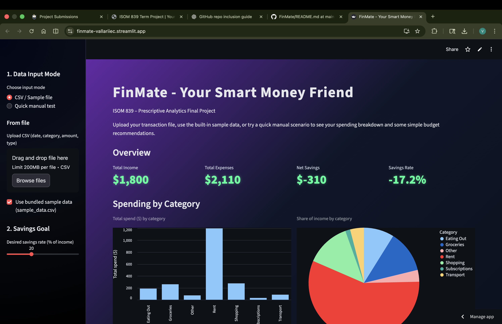
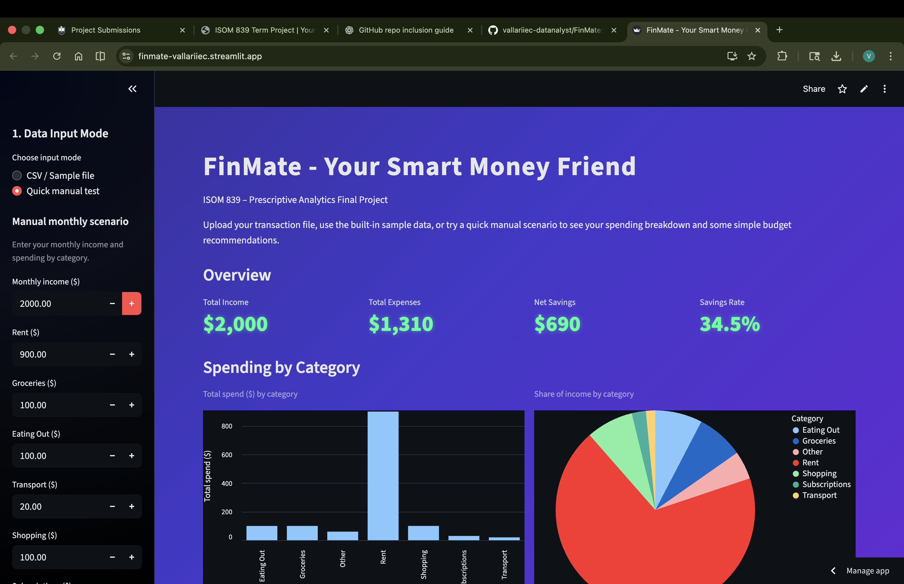
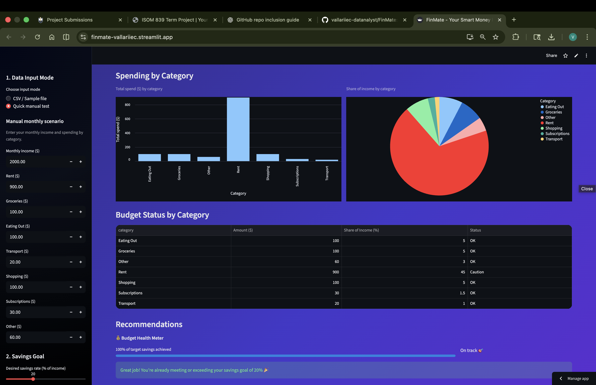
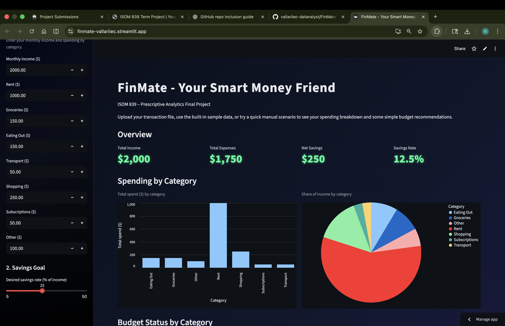
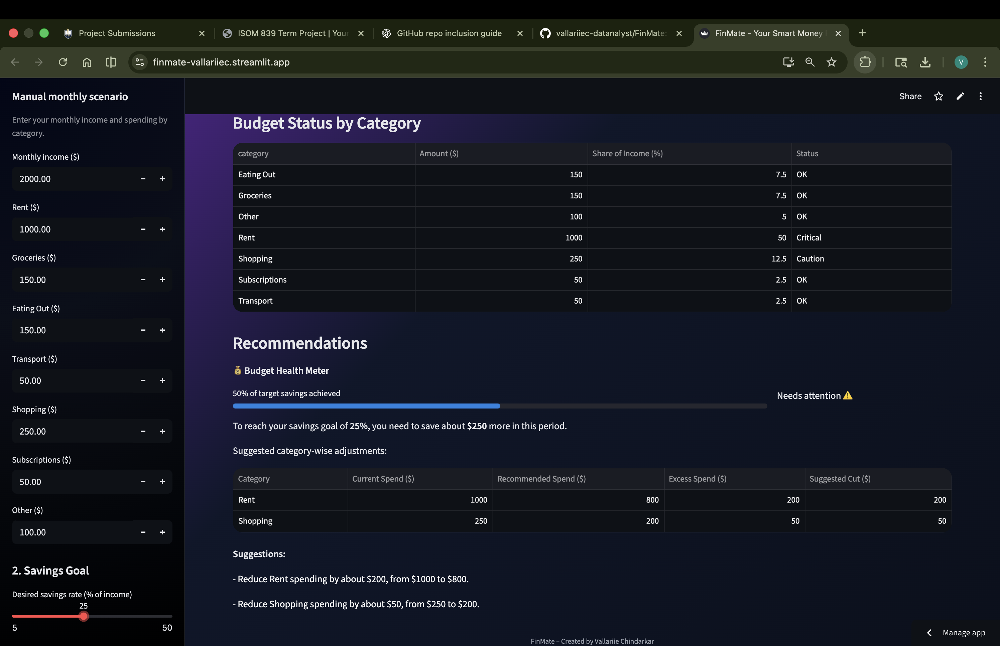

<p align="left">
  
</p>

# FinMate — Your Smart Money Friend  
**ISOM 839 — Prescriptive Analytics Final Project Track B Fall 2025**

**Creator:** *Vallariie Chindarkar*  

**Streamlit App:** https://finmate-vallariiec.streamlit.app/  
**Loom Walkthrough Video:** https://www.loom.com/share/1d4b2e2570f0438cad72c3b5f36d3f99
**Pitch Deck:** FinMate_pitchdeckbyVallariie.pdf

## Overview

**FinMate** is an intelligent budgeting and savings coach designed for **students and young professionals**.  
It transforms raw transaction data into *actionable financial guidance*, providing personalized recommendations that help users achieve their desired savings goals.

Most students track expenses but never receive *prescriptive feedback* — they know *how much* they spent, not *what to change*.  
FinMate bridges this gap with analytics-driven insights that answer:  
> “What exactly should I adjust to meet my savings target?”

---

## Problem & Value Proposition

**The Challenge**  
- Fragmented expense tracking with no behavioral insights  
- Inability to translate spending data into specific, actionable goals  
- Budgeting apps built for general users, not student lifestyles  

**The FinMate Advantage**  
- Simplifies financial decisions using analytics  
- Offers real-time budget diagnostics and tailored recommendations  
- Provides an engaging, futuristic dashboard experience  

FinMate empowers students to **make better spending choices**, improve financial literacy, and achieve consistent savings — not just track them. Managing money effectively is one of the biggest challenges students face. FinMate helps users understand where their money goes and suggests the best possible allocation using prescriptive analytics.


*FinMate’s interactive Streamlit dashboard where users begin their financial journey.*

---

## Analytics & Methodology

FinMate applies the full **prescriptive analytics framework**:

### 1️. Data Ingestion
Accepts uploaded CSVs or manual input (monthly income + category expenses).

### 2️. Descriptive Analytics
Calculates key financial KPIs:
- Total Income  
- Total Expenses  
- Net Savings  
- Savings Rate (%)  

### 3️. Diagnostic Analytics
Benchmarks spending by category against target budget rules:

```python
TARGET_BUDGET = {
    "Rent": 0.40,
    "Groceries": 0.15,
    "Eating Out": 0.10,
    "Transport": 0.10,
    "Shopping": 0.10,
    "Subscriptions": 0.05,
    "Other": 0.10
}
```

Each category is labeled as **OK / Caution / Critical** based on deviation.

### 4️. Prescriptive Analytics
- Calculates exact *suggested cuts* per category  
- Quantifies the *savings gap* to reach the desired rate  
- Generates *plain-language recommendations* for easy understanding  


FinMate uses a linear optimization model built in Python to recommend optimal budget allocation. It balances fixed expenses, savings, and discretionary spending while maximizing utility.


*Users input their income, expenses, and financial goals.*


*Optimization logic summary — balancing goals and constraints.*

---

## Core Features

| Feature | Description |
|----------|-------------|
| **Interactive Dashboard** | Real-time metrics and category-wise charts using Altair |
| **Budget Health Meter** | Visual gauge of savings goal progress with risk labels |
| **Plain-Language Suggestions** | Clear text guidance like “Reduce Eating Out by $30” |
| **Manual Input Mode** | Test scenarios instantly without uploading a file |
| **Sample Dataset** | Built-in `sample_data.csv` for demo or testing |
| **Modern UI Theme** | Animated dark-rainbow background with neon-green KPIs |

---

## Dataset Schema

| Column | Description | Example |
|---------|--------------|---------|
| `date` | Transaction date | 2025-11-05 |
| `category` | Expense category | Groceries |
| `amount` | Transaction amount (USD) | 85.00 |
| `type` | `income` or `expense` | expense |
| `payment_method` | (Optional) Credit Card / Cash | Credit Card |
| `is_recurring` | (Optional) True / False | True |

A sample dataset is included for immediate use.

---

## Tech Stack

| Layer | Technology |
|--------|-------------|
| **Language** | Python 3.11 |
| **Framework** | Streamlit |
| **Libraries** | pandas · numpy · altair |
| **Deployment** | Streamlit Cloud |
| **Version Control** | Git + GitHub |

---

## Project Structure

```
FinMate/
│
├── app.py               # Streamlit application logic
├── sample_data.csv      # Example dataset
├── requirements.txt     # Dependencies
└── README.md            # Documentation
```

---

## Local Setup & Usage

```bash
# Clone repository
git clone https://github.com/vallariiec-datanalyst/FinMate.git
cd FinMate

# Install dependencies
pip install -r requirements.txt

# Launch app
streamlit run app.py
```

---
## Working Prototype

The app provides personalized budget recommendations instantly based on user data.


*FinMate’s prescriptive analytics engine generates optimized monthly budgets.*


*Interactive visualization of spending and savings using Altair.*

---

## Deployment

FinMate is deployed via **Streamlit Cloud** for seamless public access:  
[https://finmate-vallariiec.streamlit.app](https://finmate-vallariiec.streamlit.app)

Each GitHub commit automatically updates the hosted app.

---

## Demonstration Video

A 3–5 minute **Loom** presentation covers:
- Problem Identification & Motivation  
- Analytics Workflow (Descriptive → Prescriptive)  
- Live Dashboard Walkthrough  
- Budget Health Meter & Recommendations  
- Future Vision  

*https://www.loom.com/share/1d4b2e2570f0438cad72c3b5f36d3f99*

---

## Design & User Experience

FinMate’s design blends **modern minimalism with a futuristic aesthetic**:  
- Animated dark-rainbow background for visual depth  
- Glass-panel cards and soft shadows for a premium feel  
- Neon-green financial metrics that highlight performance  
- Intuitive sidebar and interactive sliders for instant insight  

The interface is built for *clarity, immersion, and trust* — appealing to both students and investors.

---

## Future Enhancements

| Goal | Description |
|------|-------------|
| **Real-Time Bank Integration** | Connect with Plaid API for live transactions |
| **AI Auto-Categorization** | NLP model for dynamic expense classification |
| **Predictive Forecasting** | ML model to estimate next-month savings |
| **Gamified Savings Streaks** | Points & badges for meeting goals |
| **Premium Dashboard** | Subscription tier with advanced analytics |

---

## Impact & Learning Outcomes

- Demonstrated full **Descriptive → Diagnostic → Prescriptive** analytics pipeline  
- Built a deployable **Streamlit web application**  
- Applied **data visualization & budget benchmarking** principles  
- Showcased **decision-support system design** for real financial use-cases  

FinMate exemplifies how analytics can drive meaningful, personalized action — turning insights into behavior change.

---

## License
This project is shared for **academic evaluation purposes only**.  
All rights reserved © 2025 **Vallariie Chindarkar**.  
Unauthorized use, copying, or distribution of this code or design is prohibited without prior written permission from the author.

---

## Contact

**Vallariie Chindarkar**  
*M.S. Business Analytics — Suffolk University*  
vallariie.chindarkar@su.suffolk.edu  
vallariie.chindarkar@gmail.com  
[LinkedIn Profile](https://www.linkedin.com/in/vallariiec/) 

---

> *FinMate — Empowering students to spend smarter, save faster, and live confidently through prescriptive analytics.*
